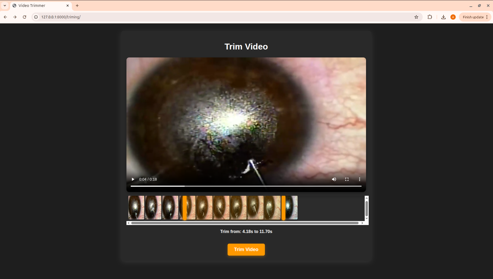

# VideoFair – YOLOv8-powered Video Segmentation → HLS Pipeline (Django + Celery)

A production-ready Django app that lets users upload a video, select a time window, run **instance segmentation** with **Ultralytics YOLOv8** only within that window, burn visualizations into the frames, and export an **HLS (HTTP Live Streaming)** playlist (`.m3u8` + `.ts`) via `ffmpeg`. Heavy work is offloaded to **Celery** workers.

---

## ✨ Features

* **Upload → Trim → Process → Stream** end-to-end flow
* **Time-windowed inference:** run detection only between `start_time` and `end_time`
* **YOLOv8 segmentation:** masks, boxes, centers, names; rendered on frames
* **HLS output:** VOD playlist (`output.m3u8`) with ~10s segments
* **Background jobs:** Celery task queues
* **Progress logging:** FPS, duration, frame counter, per-video total time
* **Extensible:** swap models, change codecs, alter post-processing easily

---

## 🧠 How it works (at a glance)

```
User Uploads Video ──▶ /upload  ──▶ Save VideoModels instance
                                   │
                                   ▼
                          /trim_video (POST)
                   set start_time / end_time
                                   │
                                   ▼
                        Celery Task convert_to_hls()
            ┌──────────────────────────────────────────────────────────┐
            │ 1) OpenCV reads frames                                   │
            │ 2) Only within [start_time, end_time]:                   │
            │    - YOLOv8 segmentation                                 │
            │    - r.plot() overlay (masks/boxes)                      │
            │ 3) Frames written with VideoSaver → processed_video.avi  │
            │ 4) ffmpeg → HLS: output.m3u8 + segments                  │
            │ 5) Mark video.hls_ready = True                           │
            └──────────────────────────────────────────────────────────┘
```

---

## 🧱 Project structure (relevant bits)

```
your_django_app/
├─ models.py               # VideoModels (title, video_file, start_time, end_time, hls_ready, ...)
├─ forms.py                # VideoForm, VideoTrimingForm
├─ tasks.py                # Celery task: convert_to_hls
├─ views.py                # UploadView, TrimingView, trim_video, VideoListView
├─ templates/
│  ├─ upload.html
│  ├─ trimizing.html       # (typo in name kept intentionally to match code)
│  └─ videofair.html
├─ models/                 # Folder holding YOLO model weights (e.g., bestIman.pt)
└─ ...
```

---

## 🔧 Requirements

* **Python** 3.9–3.12 (test with your env; OpenCV wheels vary)
* **Django** 4.x or 5.x
* **Celery** 5.x
* **Redis** or **RabbitMQ** as broker (example uses Redis)
* **FFmpeg** (system install; required for HLS)
* **OpenCV** (cv2)
* **Ultralytics** (YOLOv8)
* **Pillow**, **NumPy**

Example `requirements.txt`:

```txt
Django>=4.2,<6
celery>=5.3
redis>=5.0
ultralytics>=8.0.0
opencv-python>=4.9.0
Pillow>=10.0.0
numpy>=1.24.0
```

> **FFmpeg install:**
>
> * macOS: `brew install ffmpeg`
> * Ubuntu/Debian: `sudo apt-get update && sudo apt-get install -y ffmpeg`
> * Windows: download FFmpeg build and add to PATH.

---

## ⚙️ Configuration

Environment variables you’ll likely need:

| Variable                | Example                                | Purpose                        |
| ----------------------- | -------------------------------------- | ------------------------------ |
| `DJANGO_SECRET_KEY`     | `super-secret`                         | Django secret key              |
| `DEBUG`                 | `True` / `False`                       | Django debug                   |
| `DATABASE_URL`          | `sqlite:///db.sqlite3` or Postgres URL | DB                             |
| `CELERY_BROKER_URL`     | `redis://localhost:6379/0`             | Celery broker                  |
| `CELERY_RESULT_BACKEND` | `redis://localhost:6379/1`             | Celery backend                 |
| `MEDIA_ROOT`            | `/path/to/media`                       | File storage                   |
| `YOLO_MODEL_PATH`       | `models/bestIman.pt`                   | Weights path (align with code) |

> The code uses a hardcoded path: `YOLO("models/bestIman.pt")`.
> You can swap this for an env-driven path in `convert_to_hls` if desired.

Make sure your Django `settings.py` sets `MEDIA_ROOT` / `MEDIA_URL` appropriately and your web server can serve the HLS output directory.

---

## ▶️ Quickstart

1. **Clone & install deps**

```bash
git clone <your-repo-url>
cd <your-repo>
python -m venv .venv && source .venv/bin/activate   # On Windows: .venv\Scripts\activate
pip install -r requirements.txt
```

2. **Install FFmpeg**

See the section above for your OS.

3. **Run migrations & create superuser**

```bash
python manage.py migrate
python manage.py createsuperuser
```

4. **Start Redis** (or your chosen broker)

```bash
# macOS (brew):
brew services start redis

# Ubuntu/Debian:
sudo apt-get install -y redis-server
sudo systemctl enable --now redis-server
```

5. **Run Django + Celery**

In one terminal:

```bash
python manage.py runserver
```

In a second terminal:

```bash
celery -A your_project_name worker -l info
```

> Replace `your_project_name` with the Django settings module’s project (the one that has `celery.py` if you have a standard layout). If you haven’t set up a `celery.py`, you can start Celery with `celery -A your_project_name worker --pool=solo -l info` during development.

---

## 🧭 User flow

1. **Upload**: open `/upload` (`UploadView`, template `upload.html`) and submit a video and title.
   A `VideoModels` row is created with your file (stored in `MEDIA_ROOT`).

2. **Trim**: open the trimming page (success_url `'triming'` → template `trimizing.html`).
   Choose **start** and **end** seconds and submit (POST to `trim_video`).

3. **Process (async)**: the server enqueues `convert_to_hls(video.id)` with Celery.
   Worker:

   * Reads video FPS (defaults to `10` if unknown).
   * Writes a temp processed `AVI` (`processed_video.avi`) via `VideoSaver` (XVID codec).
   * Runs YOLOv8 segmentation only within your time window.
   * Calls `ffmpeg -hls_time 10 -hls_playlist_type vod` → `output.m3u8` in an `output/<video_title_safe>` folder.
   * Sets `video.hls_ready = True`.

4. **Watch**: serve the HLS directory over HTTP (e.g., Nginx/Apache/WhiteNoise for dev) and play `output.m3u8` with an HLS-capable player (hls.js, Safari, VLC).

---
## Loading Screen



## 🧩 Key components (code tour)

### `VideoSaver`

* Wraps `cv.VideoWriter` (XVID) with enforced frame size (default `640×640`).
* Methods: `saveFrame(frame)`, `end()`.

### `VideoSegmenter` (base)

* Iterates frames, computes `current_time = frame_idx / fps`.
* Only processes frames when `start_detection ≤ current_time ≤ end_detection`.
* Aggregates per-frame detections into a `video_object_dict` keyed by class name.

### `YoloV8Segmenter` (inherits `VideoSegmenter`)

* Resizes frames to `640×640` and runs `Ultralytics YOLO` once per frame.
* Extracts `masks.xy`, `boxes.conf`, `boxes.cls`, `boxes.xyxy`.
* Renders overlays via `r.plot()` for a user-friendly preview video.
* Converts class `0` → `"Eye"`, otherwise `"Needle"` (customize this map).

### Celery task: `convert_to_hls(video_id)`

* Loads `VideoModels` row, computes safe output dir name using `video.title`.
* Creates `processed_video.avi` with overlays and **then** HLS via `ffmpeg`.
* Updates `video.hls_ready = True`.

### Django views

* `VideoListView` → `videofair.html` lists videos
* `UploadView` → `upload.html` form to upload a file
* `TrimingView` → `trimizing.html` (preloads `VideoModels.objects.last()`)
* `trim_video(request, video_id)` → POST handler to set times and enqueue Celery task. Returns JSON.

---

## 🖥️ Serving the HLS output

**Directory layout per video** (example):

```
/media/videos/<video_file_dir>/
└─ output/<video_title_safe>/
   ├─ processed_video.avi
   ├─ output.m3u8
   ├─ output0.ts
   ├─ output1.ts
   └─ ...
```

**Nginx snippet** (example):

```nginx
location /media/ {
    alias /path/to/MEDIA_ROOT/;
    add_header Cache-Control "no-cache";
    types {
        application/vnd.apple.mpegurl m3u8;
        video/mp2t ts;
    }
}
```

Then your player can load:
`/media/videos/<...>/output/<video_title_safe>/output.m3u8`

---
<video src="docs/assets/final.avi" controls width="720"></video>
## 🧪 Testing the trim API quickly

```bash
curl -X POST http://127.0.0.1:8000/trim_video/123/ \
  -d "start_time=5" -d "end_time=25" \
  -H "X-CSRFToken: <token-if-needed>"
```

Response on success:

```json
{"message": "Video trimming started successfully!"}
```

---

## ⚡ Performance & Quality Tips

* **GPU acceleration:** install PyTorch + CUDA and Ultralytics with GPU support to speed up YOLOv8 inference dramatically.
* **Batching / stride:** For live pipelines, consider frame skipping or downscaling for speed; here we resize to `640×640`.
* **Codec choice:** `XVID` AVI is widely compatible; for smaller files you can switch to `mp4v` or H.264 (`avc1`) if your FFmpeg/OpenCV build supports it. Adjust:

  ```python
  fourcc = cv.VideoWriter_fourcc(*"mp4v")  # or "avc1" if available
  ```
* **Class map:** The example maps `0 → Eye`, everything else → `Needle`. Update based on your trained model’s `names` metadata (`model.names`).
* **IO throughput:** Place `MEDIA_ROOT` on fast storage; avoid NFS during heavy workloads.

---

## 🧰 Troubleshooting

* **`FFmpeg not found`**: Ensure `ffmpeg` is installed and on PATH. `ffmpeg -version` should work from the same shell as your Celery worker.
* **OpenCV FPS is 0**: The code falls back to `10`. If your input uses a rare codec, re-mux with FFmpeg:

  ```bash
  ffmpeg -i input.mp4 -c copy -map 0 fixed.mp4
  ```
* **`Permission denied` writing output**: Check filesystem permissions for the user running Celery/Django.
* **YOLO weights path wrong**: Ensure `models/bestIman.pt` exists relative to the Django app working directory, or change the path.
* **Windows path quoting**: Use quotes around paths in the ffmpeg command or build the `subprocess` call as a list:

  ```python
  subprocess.run(["ffmpeg", "-i", temp_output_path, "-hls_time", "10",
                  "-hls_playlist_type", "vod", hls_output_path], check=True)
  ```

---

## 🔐 Security notes

* Validate upload **file types** and **max size** (e.g., via `FileExtensionValidator`, custom cleaning, Nginx limits).
* Sanitize `video.title` (the code already replaces non-alnum with `_` for output dir).
* Consider scanning uploads and running FFmpeg in a sandboxed environment for untrusted users.

---

## 🔄 Customization ideas

* Serve HLS via **signed URLs** or put behind auth.
* Store generated objects (`video_object_dict`) in DB for analytics.
* Expose **progress** via Celery result backend and WebSocket updates.
* Add **model selection** per video (dropdown to choose which `.pt` file).
* Switch to **MP4 + HLS** directly (use `-codec:v libx264 -preset veryfast -crf 23`).

---

## 📜 License & Credits

* Built with **Django**, **Celery**, **Ultralytics YOLOv8**, **OpenCV**, **FFmpeg**.
* Your project’s license: *(add your license here)*
* YOLOv8: © Ultralytics – follow their license/terms.

---

## ✅ Definition of Done (checklist)

* [ ] FFmpeg installed and reachable by Celery worker
* [ ] `models/bestIman.pt` present (or path adjusted)
* [ ] Broker running (Redis/RabbitMQ)
* [ ] `MEDIA_ROOT` writable
* [ ] Upload works, trim POST returns 200
* [ ] Celery worker logs show frame processing
* [ ] `output.m3u8` + `.ts` segments generated
* [ ] HLS playlist plays in browser/VideoJS/hls.js/Safari


