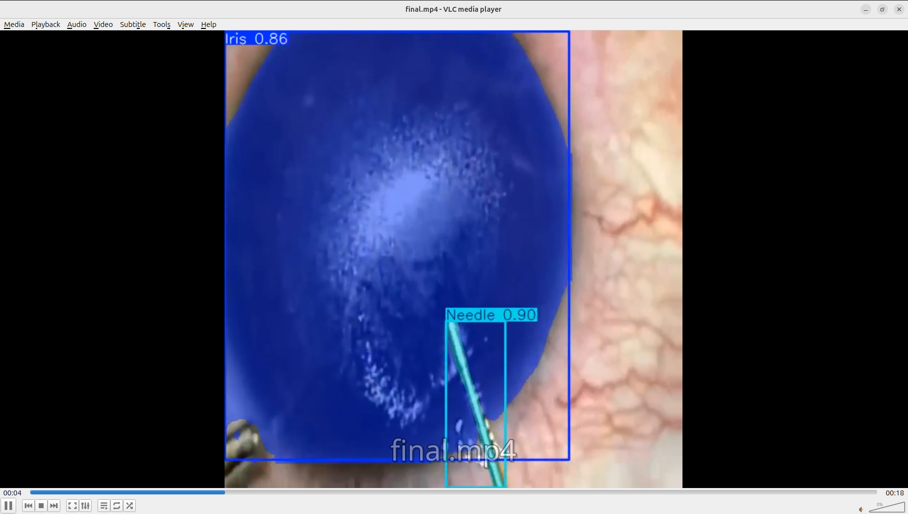

Got it 👍 — here’s the **shortened README** with the **pictures included** (kept minimal, only the essentials + visuals).

---

# VideoFair — YOLOv8 Segmentation → HLS (Django + Celery)

**Upload → Trim → Segment → Stream**
YOLOv8 segmentation on selected time ranges. Export as HLS (`.m3u8` + `.ts`). Heavy lifting via **Celery**.

---

## ✨ Features

* Time-windowed YOLOv8 segmentation
* Burned overlays on frames
* HLS output via FFmpeg
* Async Celery jobs
* Easy to swap weights/codecs

---

## ⚙️ Tech

Django · Celery · Redis/RabbitMQ · YOLOv8 · OpenCV · FFmpeg

---

## 🔧 Setup

```bash
git clone <repo>
cd <repo>
python -m venv .venv && source .venv/bin/activate
pip install -r requirements.txt
python manage.py migrate && python manage.py createsuperuser
```

Start:

```bash
redis-server   # or rabbitmq
python manage.py runserver
celery -A <project> worker -l info
```

---

## 🧭 Flow

1. **Upload video** → `/upload`
2. **Trim** (start/end sec) → `/triming`
3. **Celery task**: run YOLO only in that window, write `processed_video.avi`, export `output.m3u8`
4. **Play** playlist with hls.js/Safari/VLC

---

## 📂 Output

```
/media/videos/<upload_dir>/output/<title>/
  ├─ processed_video.avi
  ├─ output.m3u8
  ├─ output0.ts, output1.ts, ...
```

---

## 🖼️ Screens

**Loading Screen**


**Result Example**


---

## ✅ Checklist

* [ ] FFmpeg installed
* [ ] Broker running
* [ ] YOLO weights present (`models/bestIman.pt`)
* [ ] `MEDIA_ROOT` writable
* [ ] `.m3u8` + `.ts` generated and playable

---

Do you also want me to **add a GIF/video preview of the HLS playback** in the README (so users can see it working in motion)?
